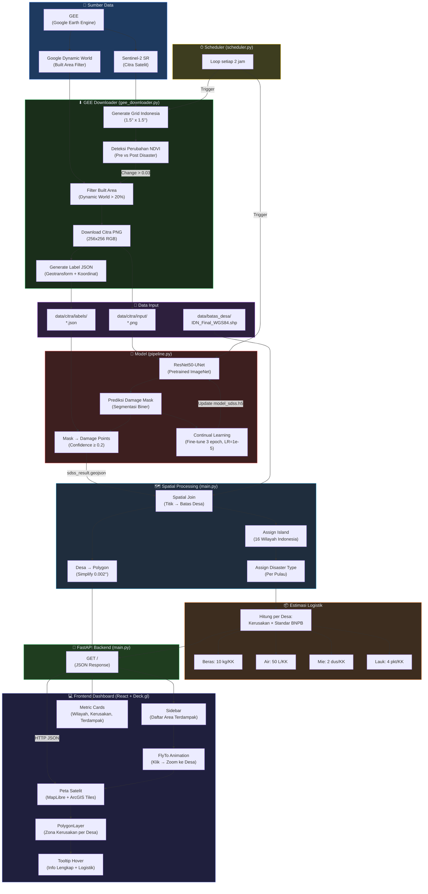

# Arsitektur Sistem SDSS Logistik Bencana

## Diagram Alur Sistem Lengkap



## Mapping File ↔ Komponen

| Komponen | File | Fungsi Utama |
|----------|------|-------------|
| **GEE Downloader** | `gee_downloader.py` | Scan grid Indonesia, deteksi perubahan NDVI, download citra Sentinel-2 |
| **Scheduler** | `scheduler.py` | Loop setiap 2 jam: GEE scan → Pipeline deteksi |
| **Pipeline Model** | `pipeline.py` | Load ResNet50-UNet, prediksi mask, extract damage points, continual learning |
| **Backend API** | `main.py` | Spatial join ke desa, assign disaster type, estimasi logistik, serve JSON |
| **Services** | `services.py` | Utility: haversine, snap_to_road, load geodata, island assignment |
| **Frontend App** | `App.jsx` | Layout utama: Map + Sidebar, fetch data, build PolygonLayer |
| **Map Component** | `DeckMap.jsx` | Deck.gl + MapLibre, satellite tiles, tooltip |
| **Sidebar Header** | `SidebarHeader.jsx` | Judul + badge jenis bencana |
| **Metric Cards** | `MetricCards.jsx` | Wilayah aktif, titik kerusakan, est. terdampak |
| **Logistics Table** | `LogisticsTable.jsx` | Daftar desa terdampak + estimasi logistik pangan |

## Alur Data End-to-End

```
GEE Sentinel-2 → PNG 256x256 → ResNet50-UNet → Damage Mask → Points + Confidence
    → Spatial Join (Batas Desa) → Per-Desa Aggregation
        → Polygon Boundaries (dari Shapefile)
        → Disaster Type (dari mapping pulau)
        → Logistik Pangan (Kerusakan × Standar BNPB)
            → FastAPI JSON → React Dashboard
                → Peta (PolygonLayer + Tooltip)
                → Sidebar (Daftar + FlyTo)
                → Metrics (Ringkasan)
```
