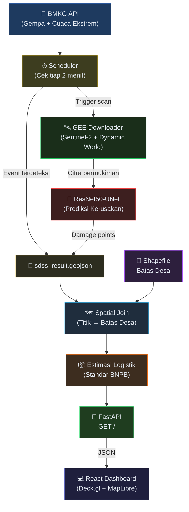

# Arsitektur Sistem SDSS Logistik Bencana

## Diagram Alur Sistem



## Alur Data

```
python main.py
  ├── FastAPI Server (port 8000)
  └── Background Scheduler (tiap 2 menit)
        ├── BMKG Gempa API → Gempa M≥5.0
        └── BMKG Nowcast CAP → Banjir / Longsor / Hujan Lebat
              │
              ├── Langsung tulis ke sdss_result.geojson
              └── GEE Scan → Filter Permukiman → Model AI → APPEND ke geojson
                    │
                    └── Spatial Join → Estimasi Logistik → Dashboard
```

## Mapping File

| File | Fungsi |
|------|--------|
| `main.py` | Entry point: FastAPI + Scheduler background thread |
| `scheduler.py` | Monitor BMKG (Gempa + Cuaca), tulis event ke geojson, trigger GEE |
| `gee_downloader.py` | Download citra Sentinel-2, filter permukiman (Dynamic World > 30%) |
| `pipeline.py` | ResNet50-UNet prediksi kerusakan, continual learning |
| `services.py` | Utility: spatial join, island assignment, load geodata |
| `App.jsx` | Frontend: Peta + Sidebar + Metrics + News Panel |

## Jenis Bencana

| Sumber | Bencana | Trigger |
|--------|---------|---------|
| BMKG Gempa API | Gempa Bumi | M ≥ 5.0 |
| BMKG Nowcast CAP | Banjir, Hujan Lebat, Longsor, Angin Kencang | Severity Moderate+ |
